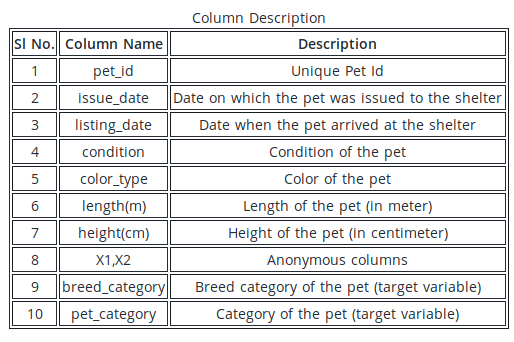
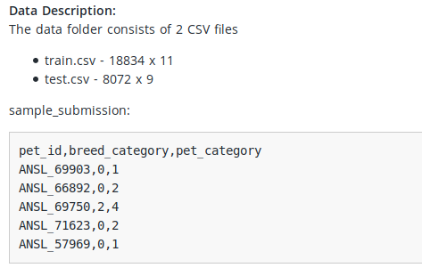
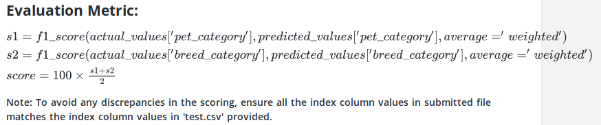

# Pet Adoption(Multi Label Classification)
Hacker-Earth Challenge(https://www.hackerearth.com/challenges/competitive/hackerearth-machine-learning-challenge-pet-adoption/problems/)

My Score: 90.30534

## Problem Statement
A leading pet adoption agency is planning to create a virtual tour experience for their customers showcasing all animals that are available in their shelter. To enable this tour experience, you are required to build a Machine Learning model that determines type and breed of the animal based on its physical attributes and other factors.

## Features
The data consists the following columns

## Data Description

## Evaluation Metric

## Datasets
1. Train.csv
2. Test.csv

## Requirements
1. Anaconda
2. Spyder
3. Markdown

## Solution Approch (XgBoost.py)
#### Pre-processing Data
1. Load Train Data and drop Target columns['breed_category','pet_category'].
2. Load Test Data.
3. Finding columns(['condition']) containing missing values.
4. Filling missing values with KNN Imputer.
5. Drop un-necessary rows like (train_df["color_type"] == "Brown Tiger") OR train_df["color_type"] == "Black Tiger").
6. Convert Categorical values(['color_type', 'issue_date', 'listing_date'])  to Numerical values using Pandas getDummies().
7. Apply Feature Scaling to columns in-order to normalize data using Min-Max-Scaler.

#### Select Important Features
1. Drop un-necessary features['pet_id'].
2. Add extra columns if required like ['condition_ismissing']

#### Select Model
1. Started with RandomForestClassifier.
2. Switched finally to XGBoostClassifier(GPU).

#### Fit & Predict & Evaluate(sklearn.metrics.f1_score)
Order of Prediction:
1. First Predict breed_category.
2. Then Predict pet_category using predicted value of breed_category.

#### Hyper-tune Parameters of Model By hand to improve score.

## References
1. HackerEarth Comments
2. https://xgboost.readthedocs.io/en/latest/parameter.html
 
